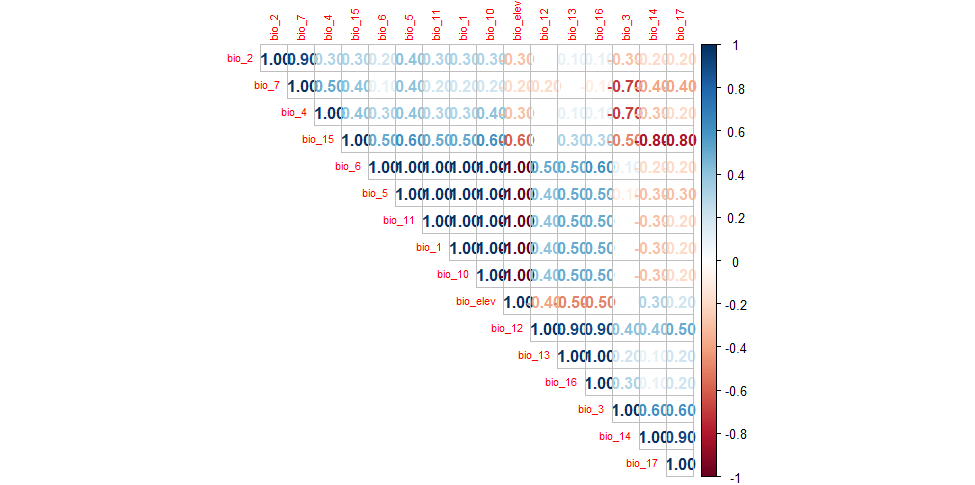

# Gustavia-santanderiensis-data
Supplementary data from the manuscript "Morphological redescription and ecological niche model of <i>Gustavia santanderiensis</i> R. Knuth (Lecythidaceae), with a key for the genus in the Magdalena Valley, Colombia"

## Ecological Niche Modeling (ENM)
The ENM was done in the software [R](https://www.r-project.org/)

Correlation variables

